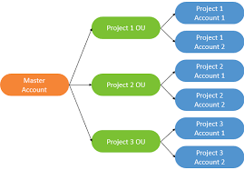

Root user privileges 
- Root user = account owner
- Has complete access to aws services 
- Do not use the root account for everyday tasks, even administrative tasks
- Root user can change account settings 
- They can view certain tax inboxes 
- Change or cancel aws support plan
- Register as a seller in the reserve instance market place. 
- Configure s3 bucket to enable mfa

IAM Access analyzer 
Used to find out which resources are shared externally.
- S3 buckets
- IAM roles 
- KMS keys
- Lambda Functions and layers 
- SQS queues 
- Secret manager secrets
- Define a zone of trust = Aws Account or AWS Organization 
- Access outside zone of trusts => findings 

- Shared Responsability in AWS
- Sheild: Automatic DDoS protection +24/7 support for advacned 
- WAF: Firewall to filter incoming rtequests based on rules 
- KMS: Encryption keys managed by AWS
- CloudHSM: Hardware encryption wer manage these keys 
- AWS Certificate manager: Provision, manage, and deploy SSL/TLS Certificates 
- Artificat: Get access to compliance reports such a PCI, ISO etc
- Guard duty: Find Malicious behvaior with VPC, DNS and CloudTrial Logs
- Inspector: find softwear vulnerabilities in EC2, ECR images, and Lambda functions 
- Config: Track congif and compliance agaisnt rules 
- Macie: Find sensative data i ns3 buckets 
- CloudTrial: Track Api calss amde by useres with an account 
- AWS Security Hub: gather security fidnings form multiple AWS accounts
- Amazon Detection: finbd the root cause of security issues or suspicious activity 
- Aws Abuse: report AWS resources used for abusive or illegal purposes 
- Root User Privilages: change account settings - close aWS account- Change or cancle your AWS Support plan 

# Machine learning 

## Amazon Rekognition 
- Find objects, people, text, scenes in images and videos using ML
- Facial analyaiss and facial search to do user verification, poeple counbting
- create a database of familiar faces or compare against celebrities 
### use cases
- Labeling 
- content moderation 
- Text detection 
- Face detection 
- face search verification 
- celebrity recognition
- pathing - (for sport analysis)

## Amazon Transcribe 
- automates speach into text
- uses deep learnig proces called automatic speach recognition (ASR) to convert speach to text quickly and accuratly 
- Automatically remove personally identifiable information using redaction 
- Supports automatic language identification for multi-lingual audio 
### use cases 
- Transcribe customer service calls 
- automate closed captioning and subtitling 
- generate metadata for media assets to create a fully searchable archive 

## Amazon polly 
- Turns text into speach 
- Allows you to create applications that talk 

## Amazon Translate 
- Natural and accurate language translation 
- Allows you to localize content for international users. Also easily translates large volumes of text efficiently 

## Amazon lex and connect 
- Amazon lex: (same technology that powers Alexa) 
- Automatic speach recognition to convert text to speach 
- Natural language understanding to recognise the intent of text, callers
- helps build chatbots, call center bots
- Amazon connect Recive calls, Create contact flows, cloud based virtual contact center 
- can integrate with other CRM systems opr AWS 
- No upfront cost, 80% cheaper than traditioanl contact center solutuions 

## Amazon Comprehend 
- For natural Language processing 
- fully managed and serveless service 
- Uses machine learning to find insights and relationships in text - can understand language of the text - Extracts key phrases, places, people, brands, or events - Undertsnads how positive or negative the text is - analysis text using tokenization and parts of speech - Automatically organises a collection of text files by topic. 
### Use cases 
- Analyze customer interactions to find out what leds to a positive or negative experience 
- create and group articles by topics that comprehend will uncover 

## Amazon SageMaker
- fully managed service for developers / data scientists to build ML models 
- Typically difficult to do all the processes in one place + privion servers
- ML process (simplified): predicting your exam score 

## Amazon Forcats
- Fully managed service that uses ML to deliver highly accurate forecasts 
- an predict the future sales of a raincoat 
- 50% more accurate than looking at the data itself 
- reduce forecasting time from months to hours 
### use cases
- Product demand planning 
- finacnial planning 
- resource planning 

## Amazon Kendra
- Fully managed document search service powered by ML
- Extract answers from within a document (text,pdf,html,PowerPoint,MS Word, FAQs)
- learn from user interactions/feedback to promote preffered reasults 
- Ability to manually fine-tune search results

## Amazon Personalise 
- Fully managed ML-service to build apps with real-time personalized recomendations 
- Eg presonalised product recomendatiosn/re-ranking, customised direct marketing.
- used by amazon.com
- very quick takes days not months to build the model
### Use cases
- retail - media and entertainment  

## Amazon textract
- used to extract text, handrwiting and data from any scanned documents using AI and ML 
### Use cases
- finacial services to provide financial reports 
- health care for medical records
- public sector e.g. tax forms or ID documents 
---
# Account management, Billing and Support Section 

## Aws Organisations 
- Global Service 
- Allows to manage multiple AWS accounts 
- The main account is the master account 
- Cost Benefit 
- Consolidate Billing across all accounts - single payment method 
- Pricing benefits from aggregate usage (volume discount for ec2, s3 ... )
- pooling reserved EC2 insatnces for optimal savings 
- API avaliable to automate AWS account creation 
- Restrict account privileges using Service Control Policies 
## Multi Account Strategies 
- create accounts per department, per cost center, per dev/test/prod, based on regulatory restrictions, for better resource isolation, to have seperate per-account service limits, isolated account for logging 
- Multi account vs one account multiple VPC
- use taggihng standards for billing purposes 
- Enable CloudTrail on all accounts, send logs to central S3 account 
- Send CloudWatch logs to central logging account 
## Organizational Units -Examples 

## AWS Organizations 

## Service controll policy (SCP)
- Whitelist or blacklist IAM actions 
- Applied at the OU or Account levle 
- Does not apply to the master account 
- SCP is applied to all the Users and roles of the account, including root 
- The SCP does nbot affect Service-Linked roles - Service linked roles enable other AWS services to intergrate with AWS Organisations and can't be restricted by SCPs.
- SCP must have an explicit Aloow (does not allow anythign  by default)
### use cases 
- REstrict access to certain services 
- Enforce PCI Complaince by explicitly disabling services 

# Aws DataSync
- move large amounts of data from on prem to aws 
- can synchronize with s3, eFS, FSx
- Replication tasks cna be scheduled hourly, daily or weekly
- The repication tasks are incremental after the first full load

# Application discovery service and applicaiton migration 
- plan migration projects by gathering information about on prem data cneters
- server utilisation data and dependency mapping are important for migration 
- agentelss discovery - VM inventory, config, and performance history 
- agent-based Dicovery - System config, system performance, running process, and details of the network connections between systems
- result data can be viewed within aws migration hub

## Aws application migration service (MGN)
- lift-and-shift (rehost) solution which simplify migration applications to AWS
- Converts your physical, virtual and cloud based servers to run nativly on AWS

- APN = AWS Partner Network
- APN  technology Partners: provide hardwear, connectivity, and softwear
- APN Consulting Partners: porfessional services firm to help build on AWS
- APN Training partners: find who can help you leanr AWS
- AWS Competency Program: AWS competencies are granted to APN Partners who demonstrated technical proficiency and proven customer sucess in specialized solution areas. 
- AWS Navigate Program: help Partners become better partners